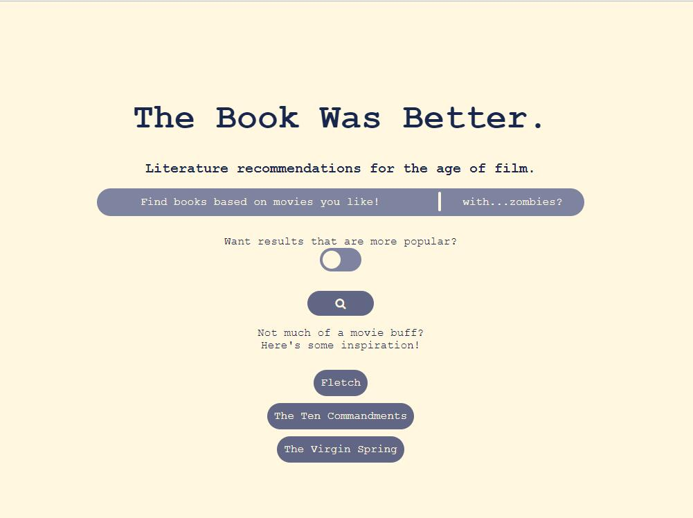

# The Book is Better Recommendation System

  Front End: Morgan Aloia

  Back End: Xingyu Chen, Caleb Chiam, Alena Hutchinson, Hartek Sabharwal

## Overview

The Book was Better is a recommendation system built for those fond of stories. We ask the user for movies or books that they like, along with a pertinent keyword and an optional popularity boost, and in turn give them recommendations of the converse media type.
This application is meant to be an exploration, allowing users to find novel works specific to their tastes and current interest that they would not necessarily be otherwise exposed to.

### main layout

### search result : option of key word search and adding user feedback

### review highlighting

## App Link
The latest app could be found here: [Link](http://the-book-was-better.herokuapp.com/)

## Use Cases
1. You don’t read. Our app can find what you might enjoy based on what you’ve watched. 
2. You do read; you know what a semicolon is; you liked To Kill A Mockingbird but really more so the “Determined Defeatist” Atticus Finch.
3. You have nothing to talk about. You care a bit more about seeing/reading something popular than something especially similar to what you know.
4. You’re a hipster. You want the movie that maybe no one’s seen but with the most similar plot.
5. You want a convenient way to see aggregated ratings, reviews, and summaries, not just a similarity score.
 --and you want the most salient, concise reviews with the important words bolded. (You don’t read.)
6. You like Harry Potter. You think it needs zombies. 
7. You like Titanic. You think it should have been a Western. 

## Input/Output
### Good
1. A generally good result -- try Blade Runner 2049 or Treasure Island
2. Weighting popular media works -- try Planet of the Apes
3. The keyword search works -- try Harry Potter with vampires.

### Bad
1. Second result for Kung Fu Panda is a book about a stripper. (Broad categories are ignored for sometimes minor plot devices. The tropes align really well though.)
2. First result for Wall-E is Fahrenheit 451. (If the original work’s main appeal doesn’t come from the plot, our method won’t work.)
3. We cannot handle a work not in our compiled dataset. This is a particularly salient issue for book inputs. (No results for One Hundred Years of Solitude.)

## Changes Since First Prototype

1. Accepting free-form keyword input
The user can now input a keyword that they want to enhance the specificity of their search. For example, they could now ask for something similar to Harry Potter, but with ‘zombies’

To incorporate the keyword input, we use word embeddings to find words similar to the keyword input, and then add tropes to our search that contain these words. For example, the keyword ‘zombies’ would result in tropes such as ‘Room Full Of Zombies’ to be incorporated into the query, in addition to the tropes associated with the title being queried.

2. Option to “boost” popular titles
The user can choose whether they prefer to see books/movies that are more popular rather than what offered the closest relevancy by tropes.

3. Expanded output information
The user can now explore elements of our recommendations to gain specific insights into why these recommendations were made. These elements include recommendation summaries, reviews, and trope descriptions.

We display user reviews that are centered around the average review and fall within a certain character count (to avoid long rants/reviews that only consist of certain four letter words)

We used the NLTK Vader Sentiment Analyzer to highlight the most “polar” (glowingly positive/spittingly negative) sentences in reviews. This allows us to draw the user’s attention towards the more interesting, informative portions of reviews. 

## Algorithms and ML components    
### 1. TF-IDF, Term-Doc Matrices
The main data source powering recommendations is a TF-IDF scoring of the 25,977 tropes listed for 2,933 books and 4,797 movies on tvtropes.org. We also experimented with different IDF formulas, settling on logarithmic.
### 2.Cosine similarity
This tells us how close the tropes line up without favoring works that just have a lot of tropes listed. We tried the inverted index algorithm for quicker computation.
### 3. Query expansion
Using word embeddings to find words that are similar to a keyword input, so that we can incorporate more tropes into a keyword query 
### 4. SVD 
This was used for “summary strengthening” (discussed in the next slide) but ultimately, we did not end up incorporating this in our final model. 
### 5. Pseudo-relevance feedback 
This is used to bootstrap the best trope matches in the top 2 results back on to the query.  
### 6. Conformity bias
Users generally find reviews with the mean rating to be more helpful, so those are the ones we show.

## Schematic

## Trail & Error
“Strengthening” a query by genre and/or by summary
We experimented with using tf-idf cosine similarity on other features of our dataset (summary and genre), since tropes did not always return results that we felt were adequate
Only the “summary strengthening” seemed to improve our results for series such as Harry Potter, but ultimately this method had the tendency to throw results off. If two unrelated  titles happened to have characters with the same names (eg. ‘Harry Potter’  and ‘Finding Harry’) this would cause their tf-idf summary scores to be very high, even though in reality, we would consider the plots to be thematically unrelated.
The primary issue with “genre strengthening” was that our database did not have a uniform/standardized list of genres associated with each title. 

## Challenges
We all have different opinions about what we actually wanted to see in a result. For example, one point of contention was how heavily a keyword input should be incorporated into our similarity metric. We also only have personal knowledge and experience with a very small subset of our dataset, so it was difficult to truly know how good a recommendation was in cases when we were unfamiliar with the recommended titles, except by manually reading summaries to verify that plots were similar.

## Improvements
All things considered, we came away with a clean, well developed project. That being said…

1. We could buy better server space. 
This would allow us to incorporate a larger word embedding model so that we could recognize more keyword inputs, and also generally speed things up. 
2. We could expand our datasets to be more comprehensive and complete. 
Right now, some of our titles are missing genres, summaries, reviews, and/or images
3. User Experience tinkering, though this is something that we could just go back and forth and in circles about given the subjectivity of UX
4. A “get more results like this” button on our search outputs page so that users can tune their results further in an intuitive way.

## Known Issues
Difficulty in evaluating the model (recommendations are subjective, you and I may have differing opinions about what is a good output of our system)

## Flask 

Set up guide in the set up folder.

